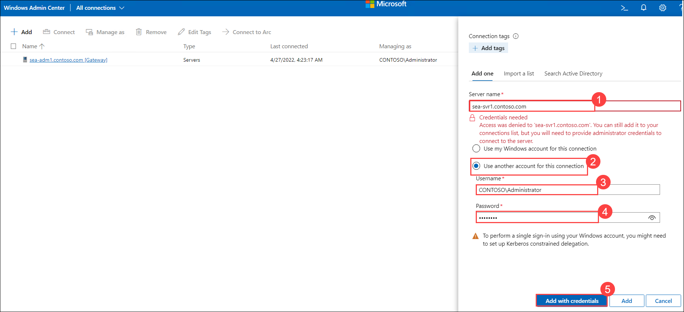
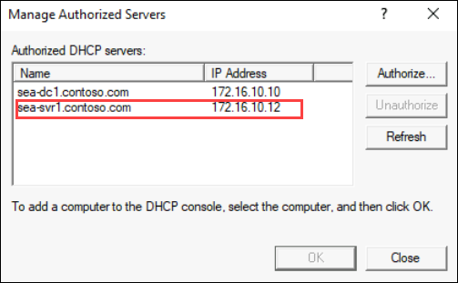
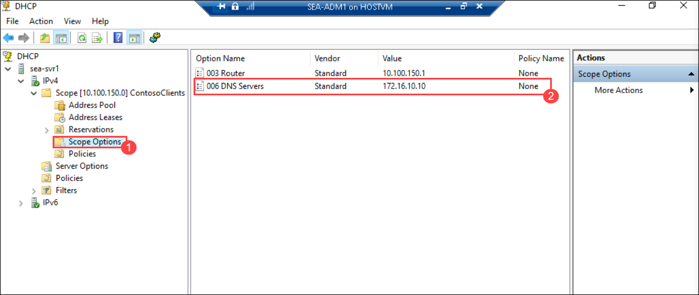
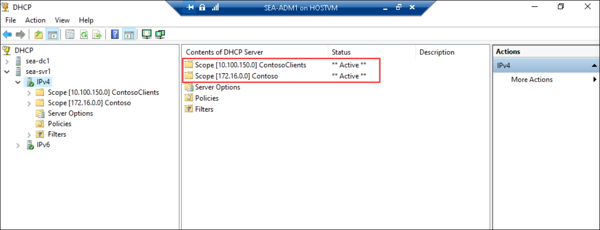
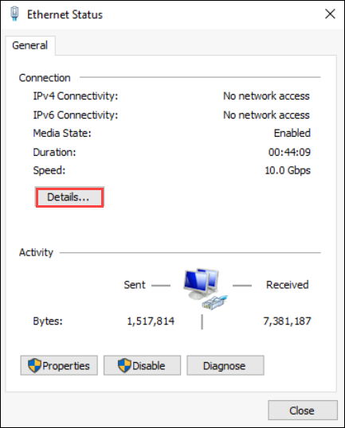

# Lab 7: Implementing and configuring network infrastructure services in Windows Server

## Lab scenario

Contoso, Ltd. is a large organization with complex requirements for network services. To help meet these requirements, you will deploy and configure DHCP so that it is highly available to ensure service availability. You will also set up DNS so that Trey Research, a department within Contoso, can have its own DNS server in the testing area. Finally, you will provide remote access to Windows Admin Center and secure it with Web Application Proxy.

**Note:** An **[interactive lab simulation](https://mslabs.cloudguides.com/guides/AZ-800%20Lab%20Simulation%20-%20Implementing%20and%20configuring%20network%20infrastructure%20services%20in%20Windows%20Server)** is available that allows you to click through this lab at your own pace. You may find slight differences between the interactive simulation and the hosted lab, but the core concepts and ideas being demonstrated are the same. 

## Lab objectives

In this lab, you will perform:

- Exercise 1: Deploy and configure DHCP.
- Exercise 2: Deploy and configure DNS.

## Estimated time: 60 minutes

## Architecture Diagram

     

## Exercise 1: Deploying and configuring DHCP

#### Task 1: Install the DHCP role

1. Connect to **SEA-ADM1**, and then, if needed, sign in as **CONTOSO\Administrator** with a password of **Pa55w.rd**.

1. On **SEA-ADM1**, select **Start**, and then select **Windows PowerShell (Admin)**.

   >**Note**: Perform the next two steps in case you have not already installed Windows Admin Center on **SEA-ADM1**.

1. In the **Windows PowerShell** console, enter the following command, and then press Enter to download the latest version of Windows Admin Center:
	
   ```powershell
   Start-BitsTransfer -Source https://aka.ms/WACDownload -Destination "$env:USERPROFILE\Downloads\WindowsAdminCenter.msi"
   ```
1. Enter the following command, and then press Enter to install Windows Admin Center:
	
   ```powershell
   Start-Process msiexec.exe -Wait -ArgumentList "/i $env:USERPROFILE\Downloads\WindowsAdminCenter.msi /qn /L*v log.txt REGISTRY_REDIRECT_PORT_80=1 SME_PORT=443 SSL_CERTIFICATE_OPTION=generate"
   ```

   > **Note**: Wait until the installation completes. This should take about 2 minutes.

1. On **SEA-ADM1**, start Microsoft Edge, and then browse to `https://SEA-ADM1.contoso.com`.
 
   >**Note**: If the link does not work, on **SEA-ADM1**, open File Explorer, select Downloads folder, in the Downloads folder select **WindowsAdminCenter.msi** file and install manually. After the install completes, refresh Microsoft Edge.

   >**Note**: If you get **NET::ERR_CERT_DATE_INVALID** error, select **Advanced** on the Edge browser page, at the bottom of page select **Continue to sea-adm1-contoso.com (unsafe)**.

   >**Note**: When **Close Successfully installed version 2311** prompted close the window.
   

1. If prompted, in the **Windows Security** dialog box, enter the following credentials, and then select **OK**:

   - Username: **CONTOSO\Administrator**
   - Password: **Pa55w.rd**

1. In the All connections pane, select **+ Add**.

1. In the Add or create resources pane, on the **Servers** tile, select **Add**.

1. In the **Server name** text box, enter **sea-svr1.contoso.com (1)**. 

1. Ensure that **Use another account for this connection (2)** option is selected, enter the following credentials, and then select **Add with credentials (5)**:

   - Username: **CONTOSO\Administrator (3)**
   - Password: **Pa55w.rd (4)**

      > **Note**: To perform single sign-on, you would need to set up a Kerberos constrained delegation.

      

1.  In **All connections** pane, select **sea-svr1.contoso.com**.
   
1. On the **sea-svr1.contoso.com** page, in the **Tools** list, select **Roles & features**.

1. In the Roles and features pane, select the **DHCP Server** checkbox, and then select **+ Install**.

1. In the Install Roles and Features pane, select **Yes**.

   > **Note**: Wait until the notification indicating that the DHCP role is installed. If necessary, select the **Notifications** icon to verify the current status.

1. Refresh the **Microsoft Edge** page back on the **sea-svr1.contoso.com** page, in the **Tools** list, select **DHCP**, and then, in the details pane, select **Install** to install the DHCP PowerShell tools. 

    > **Note**: If the **DHCP** entry is not available in the **Tools** list for **sea-svr1.contoso.com**, refresh the **Microsoft Edge** page and try again. Depending on your network performance, it may take upto 5 minutes for the DHCP server to appear.

    >**Note**: If prompted to sign in ensure that **Use another account for this connection** option is selected, enter the following credentials, and then select **Continue**:

   - Username: **CONTOSO\Administrator**
   - Password: **Pa55w.rd**

1. Wait for a notification that the DHCP PowerShell tools are installed. If necessary, select the **Notifications** icon to verify the current status.

#### Task 2: Authorize the DHCP server

1. On **SEA-ADM1**, select **Start**, and then select **Server Manager**.

1. In **Server Manager**, select **Notifications** in the menu, and then select **Complete DHCP configuration**.

1. In the **DHCP Post-Install configuration wizard** window, on the **Description** screen, select **Next**.

1. On the **Authorization** screen, ensure that the **CONTOSO\Administrator** option is selected, and then select **Commit**.

1. When you complete both tasks, select **Close**.

#### Task 3: Create a scope

1. On **SEA-ADM1**, switch to Windows Admin Center in the Microsoft Edge window displaying the **DHCP** settings on **SEA-SVR1**.

   > **Note**: It might take a few minutes for the DHCP option to appear in the menu. If necessary, refresh the connection to sea-svr1. If prompted to install the DHCP Powershell tools, select **Install**.

1. On the **DHCP** page, select **+ New scope**.

1. In the Create a new scope pane, specify the following settings, and then select **Create**.

   - Protocol: **IPv4**
   - Name: **ContosoClients**
   - Starting IP address: **10.100.150.50**
   - End IP address: **10.100.150.254**
   - DHCP client subnet mask: **255.255.255.0**
   - Router (default gateway): select **+ Add** enter **10.100.150.1**
   - Lease duration for DHCP clients: **4 days**

1. On **SEA-ADM1**, switch to **Server Manager**, in **Server Manager**, select **Tools**, and then select **DHCP**.

1. In the **DHCP** window, in the Actions pane, select **More Actions**, and then select **Manage Authorized Servers**.

1. In the **Manage Authorized Servers** window, select **Refresh**, ensure that **sea-svr1.contoso.com** appears in the list of authorized DHCP servers, and then close the **Manage Authorized Servers** window.

   

1. In the **DHCP** window, in the Actions pane, select **More Actions**, and then select **Add Server**.

1. In the **Add Server** dialog box, select **This authorized DHCP server**, select **sea-svr1.contoso.com**, and then select **OK**.

1. In the **DHCP** window, expand **sea-svr1**, expand **IPv4**, expand **Scope [10.100.150.0] ContosoClients**, and then select **Scope Options**.

1. In the Actions pane, select **More Actions**, and then select **Configure Options**.

1. In the **Scope Options (1)** dialog box, select the **006 DNS Servers (2)** checkbox.

   

1. In the **Server name** text box, enter **sea-dc1.contoso.com**, select **Resolve**, verify that the name resolves to **172.16.10.10**, select **Add**, and then select **OK**.

   >**Note**: Check for the two servers thats being showed up under **manage authorized servers** ,i.e **sea-svr1.contoso.com** and **sea-dc1.contoso.com**

#### Task 4: Configure DHCP Failover

1. On **SEA-ADM1**, in the **DHCP** window, select **IPv4**, in the Actions pane, select **More Actions**, and then select **Configure Failover**.

1. In the **Configure Failover** window, verify that the **Select all** checkbox is selected, and then select **Next**.

1. On the **Specify the partner server to use for failover** screen, select **Add Server**.

1. In the **Add Server** dialog box, select **This authorized DHCP server**, select **sea-dc1.contoso.com**, and then select **OK**.

1. Back on the **Specify the partner server to use for failover** screen, ensure that **sea-dc1** appears in the **Partner Server** drop-down list, and then select **Next**.

1. On the **Create a new failover relationship** screen, enter the following information, and then select **Next**.

   - Relationship Name: **SEA-SVR1 to SEA-DC1**
   - Maximum Client Lead Time: **1 hour**
   - Mode: **Hot standby**
   - Role of Partner Server: **Standby**
   - Addresses reserved for standby server: **5%**
   - State Switchover Interval: **Disabled**
   - Enable Message Authentication: **Enabled**
   - Shared Secret: **DHCP-Failover**

1. Select **Finish**.

1. In the **Configure Failover** dialog box, select **Close**.

1. In the **DHCP** window, select **DHCP** and in the Actions pane, select **More Actions**, and then select **Add Server**.

1. In the **Add Server** dialog box, select **This authorized DHCP server**, select **sea-dc1.contoso.com**, and then select **OK**.

1. On **SEA-ADM1**, in the **DHCP** window, expand the **sea-dc1** node, select **IPv4**, and then verify that two scopes are listed.

1. Select **Scope [172.16.0.0] Contoso**, in the Actions pane, select **More Actions**, and then select **Configure Failover**.

1. In the **Configure Failover** window, select **Next**.

1. On the **Specify the partner server to use for failover** screen, in the **Partner Server** box, enter **172.16.10.12**, select the **Reuse existing failover relationships configured with this server (if any exist)** checkbox, and then select **Next**.

1. On the **Select from failover relationships which are already configured on this server** screen, select **Next**, and then select **Finish**.

1. In the **Configure Failover** dialog box, select **Close**.

1. Under **sea-svr1**, select **IPv4**, and then verify that both scopes are listed. If necessary, press the **F5** key to refresh.

   

#### Task 5: Verify DHCP functionality

1. On **SEA-ADM1**, select **Start**, and then select **Settings**.

1. In the **Settings** window, select **Network & Internet**, and then select **Network and Sharing Center**.

1. In **Network and Sharing Center**, select **Ethernet**, and then select **Properties**.

1. In the **Ethernet Properties** dialog box, select **Internet Protocol Version 4 (TCP/IPv4)**, and then select **Properties**.

1. In the **Internet Protocol Version 4 (TCP/IPv4) Properties** dialog box, select **Obtain an IP address automatically**, select **Obtain DNS server address automatically**, and then select **OK**.

1. Select **Close**, and then, in the **Ethernet Status** window, select **Details**.

   

1. In the **Network Connection Details** dialog box, verify that DHCP is enabled, an IP address was obtained, and that the **sea-svr1** DHCP server issued the lease.

   >**Note**: It may take some time to view the list of IP address was obtained. Please proceed with the next steps and return to review the list of **IP address** afterward or else try to turn off and start svr1 machine from hyper-v manager.
   
   >**Note** If its not visiable on the Network and Sharing Center window, select Change adapter settings, select Ethernet, and double-click the Ethernet connection to display its status window and back on **Network and Sharing Center** window check the connection Ethernet.
   
1. Select **Close** to return to the **Ethernet Status** window. 

1. On **DHCP** page, select **sea-svr1**, in the Actions pane, select **More Actions**, select **All tasks**, and then select **Stop**.

1. On **SEA-ADM1**, switch back to the **Ethernet Status** window, and then select **Disable**.

1. Back in the **Network and Sharing Center** window, select **Change adapter settings**, select **Ethernet**, and then select **Enable this network device**.

1. Double-click the enabled **Ethernet** connection to display its status window.

1. In the **Ethernet Status** window, select **Details**.

1. In the **Network Connection Details** dialog box, verify that DHCP is enabled, an IP address was obtained, and that the **SEA-DC1 (172.16.10.10)** DHCP server issued the lease.

1. Select **Close** to return to the **Ethernet Status** window.

1. In the **Ethernet Status** window, select **Properties**.

1. In the **Ethernet Properties** dialog box, select **Internet Protocol Version 4 (TCP/IPv4)**, and then select **Properties**.

1. In the **Internet Protocol Version 4 (TCP/IPv4) Properties** dialog box, select **Use the following IP address** and specify the following settings:

   - IP address: **172.16.10.11**
   - Subnet mask: **255.255.0.0**
   - Default gateway: **172.16.10.1**

1. In the **Internet Protocol Version 4 (TCP/IPv4) Properties** dialog box, select **Use the following DNS server addresses**, set the **Preferred DNS server** to **172.16.10.10**, and then select **OK** twice.

   >**Note**: Leave the **Ethernet Status** window open. You will need it later in this lab.

1. On **SEA-ADM1**, in the **DHCP** window, select **sea-svr1**, in the Actions pane, select **More Actions**, select **All tasks**, and then select **Start**.

1. On **SEA-ADM1**, in the **DHCP** window, expand the **sea-svr1** node, expand the **IPv4** node, expand the **Scope [172.16.0.0] Contoso** node, and then select **Address Leases**.

1. Verify that there is an entry representing the **SEA-ADM1.contoso.com** lease.

1. On **SEA-ADM1**, in the **DHCP** window, expand the **sea-dc1** node, expand the **IPv4** node, expand the **Scope [172.16.0.0] Contoso** node, and then select **Address Leases**.

1. Verify that here as well there is an entry representing the **SEA-ADM1.contoso.com** lease.

1. On **SEA-ADM1**, in the **DHCP** window, select **sea-svr1**, in the Actions pane, select **More Actions**, select **All tasks**, and then select **Stop**.

## Exercise 2: Deploying and configuring DNS

#### Task 1: Install the DNS role

1. On **SEA-ADM1**, switch back to the Microsoft Edge window displaying the connection to **sea-svr1.contoso.com** in Windows Admin Center. 

1. In the **Tools** list, select **Roles & features**.

1. In the Roles and features pane, select the **DNS Server** checkbox, and then select **+ Install**.

1. In the Install Roles and Features pane, select **Yes**.

   > **Note**: Wait until the notification indicating that the DNS role is installed. If necessary, select the **Notifications** icon to verify the current status.

1. Refresh the **Microsoft Edge** page, back on the **sea-svr1.contoso.com** page, in the **Tools** list, select **DNS**, and then on the details pane, select **Install** to install the DNS PowerShell tools. 

   > **Note**: If the **DNS** entry is not available in the **Tools** list for **sea-svr1.contoso.com**, refresh the **Microsoft Edge** page and try again.

1. Wait until a notification appears indicating that the DNS PowerShell tools are installed. If necessary, select the **Notifications** icon to verify the current status.

  >**Note**: If prompted **DNS powershell tools are  not installed** , click on **install**.

#### Task 2: Create a DNS zone

1. On **SEA-ADM1**, in Windows Admin Center, in the DNS pane, on the **Actions** menu, select **+ Create a new DNS zone**.

1. In the **Create a new DNS zone** dialog box, specify the following settings, and then select **Create**:

   - Zone type: **Primary**
   - Zone name: **TreyResearch.net**
   - Zone file: **Create a new file**
   - Zone file name: **TreyResearch.net.dns**
   - Dynamic update: **Do not allow dynamic update**

1. Back in the DNS pane, select **TreyResearch.net** then under **Record - TreyResearch.net**, select **+ Create a new DNS record** (you need to scroll down).

1. In the **Create a new DNS record** pane, specify the following settings, and then select **Create**:

   - DNS record type: **Host (A)**
   - Record name: **TestApp**
   - IP address: **172.30.99.234**
   - Time to live: **600**

1. On **SEA-ADM1**, select **Start**, and then select **Windows PowerShell**.

1. In the **Windows PowerShell** console, enter the following command, and then press Enter to validate that the new DNS record provides the name resolution:

   ```powershell
   Resolve-DnsName -Server sea-svr1.contoso.com -Name testapp.treyresearch.net
   ```

#### Task 3: Configure forwarding

1. On **SEA-ADM1**, switch to Server Manager.

1. In Server Manager, select **Tools**, and then select **DNS**.

1. In the **Connect to DNS Server** dialog box, select **The following computer**, enter **SEA-SVR1.contoso.com**, and then select **OK**.

1. In **DNS Manager**, select **SEA-SVR1.contoso.com**, display its context-sensitive menu, right click and select **Properties**.

1. In the **SEA-SVR1.contoso.com Properties** dialog box, select the **Forwarders** tab, and then select **Edit**.

1. In the **Edit Forwarders** dialog box, in the **IP addresses for forwarding servers** box, enter **131.107.0.100**, and then select **OK**.

1. In the **SEA-SVR1.contoso.com Properties** dialog box, select **OK**.

#### Task 4: Configure conditional forwarding

1. On **SEA-ADM1**, in **DNS Manager**, expand **SEA-SVR1.contoso.com**, and then select **Conditional Forwarders**.

1. Select **Conditional Forwarders**, display its context-sensitive menu, and then, in the menu, right click and select **New Conditional Forwarder**.

1. In the **New Conditional Forwarder** dialog box, in the **DNS Domain** box, enter **Contoso.com**.

1. In the **IP addresses of the master servers** box, enter **172.16.10.10**, and then select **Enter**.

   > **Note**: Disregard the message **An unknown error occurred** in the validation column within the **New Conditional Forwarder** dialog box.

1. Select **OK**.

1. On **SEA-ADM1**, switch to the **Windows PowerShell** console.

1. In the **Windows PowerShell** console, enter the following command, and then press Enter to validate conditional forwarding:

   ```powershell
   Resolve-DnsName -Server sea-svr1.contoso.com -Name sea-dc1.contoso.com
   ```

#### Task 5: Configure DNS policies

1. On **SEA-ADM1**, switch back to the Microsoft Edge window displaying the connection to **sea-svr1.contoso.com** in Windows Admin Center.

1. In the **Tools** list, select **PowerShell**, and when prompted, sign in as the **CONTOSO\Administrator** user with **Pa55w.rd** as its password.

1. In the **Windows PowerShell** console, enter the following command, and then press Enter to create a head office subnet:

   ```powershell
   Add-DnsServerClientSubnet -Name "HeadOfficeSubnet" -IPv4Subnet '172.16.10.0/24'
   ```
1. Enter the following command, and then press Enter to create a zone scope for head office:

   ```powershell
   Add-DnsServerZoneScope -ZoneName 'TreyResearch.net' -Name 'HeadOfficeScope'
   ```
1. Enter the following command, and then press Enter to add a new resource record for the head office scope:

   ```powershell
   Add-DnsServerResourceRecord -ZoneName 'TreyResearch.net' -A -Name 'testapp' -IPv4Address '172.30.99.100' -ZoneScope 'HeadOfficeScope'
   ```
1. Enter the following command, and then press Enter to create a new policy that links the head office subnet and the zone scope:

   ```powershell
   Add-DnsServerQueryResolutionPolicy -Name 'HeadOfficePolicy' -Action ALLOW -ClientSubnet 'eq,HeadOfficeSubnet' -ZoneScope 'HeadOfficeScope,1' -ZoneName 'TreyResearch.net'
   ```

#### Task 6: Verify DNS policy functionality

1. On **SEA-ADM1**, switch to the **Windows PowerShell** console.

1. In the **Windows PowerShell** console, enter `ipconfig`, and then press Enter to display its current IP configuration.

   > **Note**: Note that the Ethernet adapter has an IP address that is part of the **HeadOfficeSubnet** configured in the policy.

1. In the **Windows PowerShell** console, enter the following command, and then press Enter to test the resolution of the `testapp.treyresearch.net` DNS record:

   ```powershell
   Resolve-DnsName -Server sea-svr1.contoso.com -Name testapp.treyresearch.net
   ```

   > **Note**: Verify that the name resolves to the IP address **172.30.99.100** that was configured in the **HeadOfficePolicy**.

1. On **SEA-ADM1**, switch back to the **Ethernet Status** window.

1. In the **Ethernet Status** window, select **Properties**.

1. In the **Ethernet Properties** dialog box, select **Internet Protocol Version 4 (TCP/IPv4)**, and then select **Properties**.

1. In the **Internet Protocol Version 4 (TCP/IPv4) Properties** dialog box, change the currently assigned IP address (**172.16.10.11**) to an IP address **172.16.11.11** that is not within the IP address range of the **HeadOfficeSubnet**, and then select **OK**.

1. On **SEA-ADM1**, switch to the **Windows PowerShell** console.

1. In the **Windows PowerShell** console, enter the following command, and then press Enter to test the resolution of the `testapp.treyresearch.net` DNS record:

   ```powershell
   Resolve-DnsName -Server sea-svr1.contoso.com -Name testapp.treyresearch.net
   ```

   > **Note**: Verify that the name resolves to **172.30.99.234**. This is expected, because the IP address of **SEA-ADM1** is no longer within the **HeadOfficeSubnet**. DNS queries originating from the **HeadOfficeSubnet** of **(172.16.10.0/24)** targeting `testapp.treyresearch.net` resolve to **172.30.99.100**. DNS queries from outside of this subnet targeting `testapp.treyresearch.net` resolve to **172.30.99.234**.

   > **Note**: Now change the IP address of **SEA-ADM1** back to its original value.

1. Switch back to the **Ethernet Status** window and select **Properties**.

1. In the **Ethernet Properties** dialog box, select **Internet Protocol Version 4 (TCP/IPv4)**, and then select **Properties**.

1. In the **Internet Protocol Version 4 (TCP/IPv4) Properties** dialog box, change the currently assigned IP address (**172.16.11.11**) to its original value (**172.16.10.11**) and select **OK**.

1. Select **Close** twice.

1. Close all open windows.

### Review
In this lab, you have completed:
- Install the DHCP role and authorize the DHCP server
- Create a scope
- Configure DHCP Failover and verify DHCP functionality
- Install and create a the DNS role
- Configure forwarding and conditional forwarding
- Configure DNS policies and verify DNS policy functionality

## You have successfully completed this lab.
