# Lab 10: Implementing Azure File Sync

## Lab scenario

To address concerns regarding Distributed File System (DFS) Replication between Contoso's London headquarters and its Seattle–based branch office, you decide to test Azure File Sync as an alternative replication mechanism between two on-premises file shares.

**Note:** An **[interactive lab simulation](https://mslabs.cloudguides.com/guides/AZ-800%20Lab%20Simulation%20-%20Implementing%20Azure%20File%20Sync)** is available that allows you to click through this lab at your own pace. You may find slight differences between the interactive simulation and the hosted lab, but the core concepts and ideas being demonstrated are the same. 

## Lab objectives

In this lab, you will perform:

- Implement DFS Replication in your on-premises environment.
- Create and configure a sync group.
- Replace DFS Replication with Azure File Sync-based replication.
- Verify replication and enable cloud tiering.
- Troubleshoot replication conflicts.

## Estimated time: 60 minutes

## Lab setup

Virtual machines: **AZ-800T00A-SEA-DC1**, **AZ-800T00A-SEA-SVR1**, **AZ-800T00A-SEA-SVR2**, and **AZ-800T00A-ADM1** must be running. 

> **Note**: **AZ-800T00A-SEA-DC1**, **AZ-800T00A-SEA-SVR1**, **AZ-800T00A-SEA-SVR2**, and **AZ-800T00A-SEA-ADM1** virtual machines are hosting the installation of **SEA-DC1**, **SEA-SVR1**, **SEA-SVR2**, and **SEA-ADM1**, respectively.

1. Select **SEA-ADM1**.

1. Sign in using the following credentials:

   - User name: **Administrator**
   - Password: **Pa55w.rd**
   - Domain: **CONTOSO**

For this lab, you'll use the available VM environment and an Azure subscription. Before you begin the lab, ensure that you have an Azure subscription and a user account with the Owner or Contributor role in that subscription.

## Exercise 1: Implementing Distributed File System (DFS) Replication in your on-premises environment

### Task 1: Deploy DFS

1. Connect to **SEA-ADM1**, and then, if needed, sign in as **CONTOSO\Administrator** with a password of **Pa55w.rd**.

1. On **SEA-ADM1**, on the **Start** menu, select **Windows PowerShell**.

1. In the **Windows PowerShell** console, enter the following, and then press Enter to install Distributed File System (DFS) management tools:

   ```powershell
   Install-WindowsFeature -Name RSAT-DFS-Mgmt-Con -IncludeManagementTools
   ```
    

1. On the taskbar, select **File Explorer**.

1. In File Explorer, browse to the **C:\Labfiles\AZ-800-Administering-Windows-Server-Hybrid-Core-Infrastructure-master\Allfiles\Labfiles\Lab10** folder.

1. In File Explorer, in the details pane, select the file **L10_DeployDFS.ps1**, display its context-sensitive menu, and then, in the menu, select **Edit**.

    

   >**Note:** This will automatically open the file **L10_DeployDFS.ps1** in the script pane of Windows PowerShell ISE.

1. In the **Windows PowerShell ISE** script pane, review the script, and then execute it by selecting the **Run Script** icon in the toolbar or by pressing F5. 

### Task 2: Test DFS deployment

1. On **SEA-ADM1**, select **Start**, enter **DFS (1)**, and then select **DFS Management (2)**.

    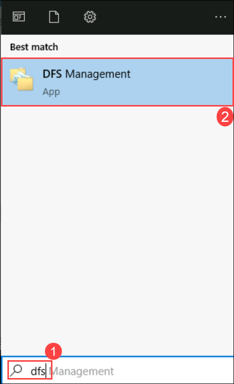

1. In **DFS Management**, in the navigation pane, right-click or access the context menu for **Namespaces(1)**, and then select **Add Namespaces to Display (2)**.

    

1. In the **Add Namespaces to Display** dialog box, in the list of namespaces, select **\\\contoso.com\Root (1)**, and then select **OK (2)**.

    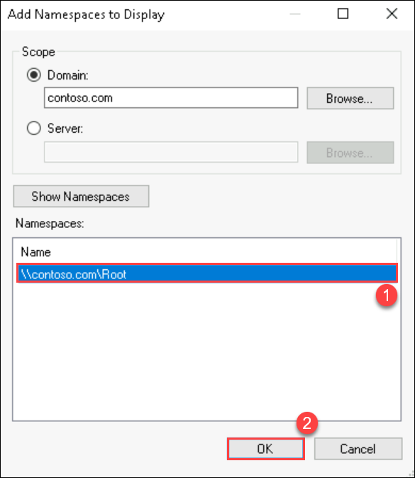

1. In the navigation pane, right-click or access the context menu for **Replication (1)**, and then select **Add Replication Groups to Display (2)**.

    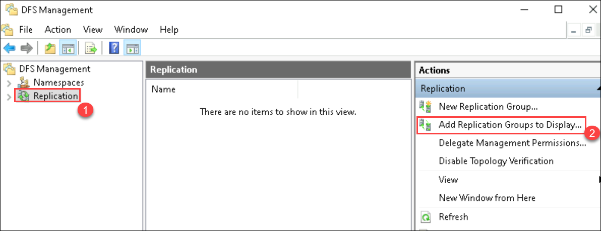

1. In the **Add Replication Groups to Display** dialog box, in the **Replication groups** section, select **Branch1 (1)**, and then select **OK (2)**.

    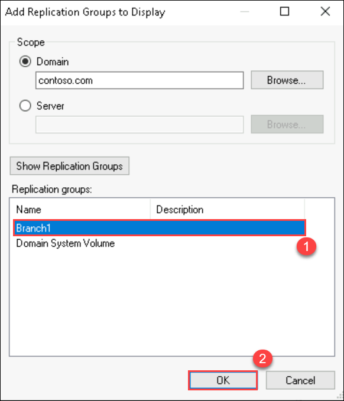

1. In the navigation pane, expand the **\\\contoso.com\Root** namespace, and then select the **Data** folder.

1. In the details pane, verify that the **Data** folder has two referrals to the **Data** folder on **SEA-SVR1** and **SEA-SVR2**.

   

1. In the navigation pane, expand **Replication** and select **Branch1**.

1. In the details pane, verify that the **S:\\Data** folder on **SEA-SVR1** and on **SEA-SVR2** are members of the **Branch1** replication group.

   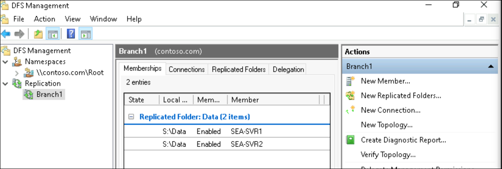


   >**Note:** DFS Replication replicates the content between the **S:\\Data** folders on **SEA-SVR1** and **SEA-SVR2**.

1. Open two instances of File Explorer, in the navigation pane, expand the **\\\contoso.com\Root** namespace, and then select the **Data** folder. 

2. Select first **SEA-SVR1**, in **Action** pane under **SEA-SVR1**, select **Open in Explorer**.

   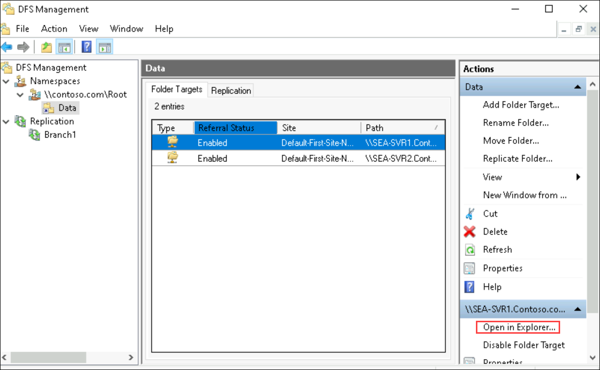


3. Select second **SEA-SVR2**, in **Action** pane under **SEA-SVR2**, select **Open in Explorer**.

   


4. In the first File Explorer instance, connect to **\\\\SEA-SVR1\\Data**, and then in the second File Explorer instance, connect to **\\\\SEA-SVR2\\Data**.

1. Create a new file with your name in **\\\\SEA-SVR1\\Data**.

1. Verify that the file with your name replicates to **\\\\SEA-SVR2\\Data** after a few seconds. This confirms that DFS Replication is working.

   >**Note:** Wait until the files are replicated and both the File Explorer windows record the same content.
   
   >**Note:** Kindly try to close and reopen two file explorer instance to see replicated files.

## Exercise 2: Creating and configuring a sync group

### Task 1: Create an Azure file share

1. On **SEA-ADM1**, start Microsoft Edge, browse to the **[Azure portal](https://portal.azure.com)**, and sign in by using the credentials of a user account with the Owner role in the subscription you'll be using in this lab.

1. In the Azure portal, in the **Search resources, services, and docs** text box in the toolbar, search for and select the **Storage accounts**.

1. On the **Storage accounts** page, select **+ Create**.

1. On the **Basics** tab of the **Create a storage account** page, specify the following settings:

   - Resource group: Select **AZ800-L1001-RG** resource group.
   - Storage account name: storage<inject key="DeploymentID" enableCopy="false"/>
   - Region: Any Azure region in your geographical area in which you can create storage accounts.

     >**Note:** Use the same region for deploying all resources in this lab.

   - Redundancy: **Locally-redundant storage (LRS)**

1. Accept the default values for all other settings, select **Review**, and then select **Create**.

   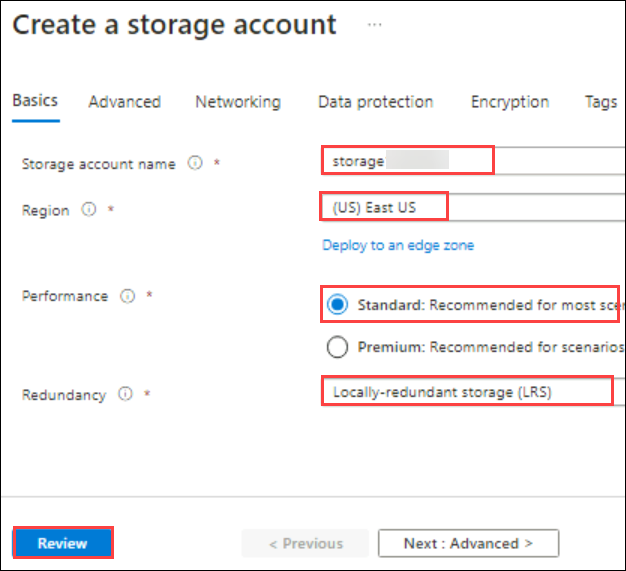

1. After the storage account is created, on the **Deployment** page, select **Go to resource**.

1. On the **storage account** page, select **File shares**, and then select **+ File share**.

1. On the **New file share** tab, enter **share1** in the **Name** text box, and then select **Review + Create**.

   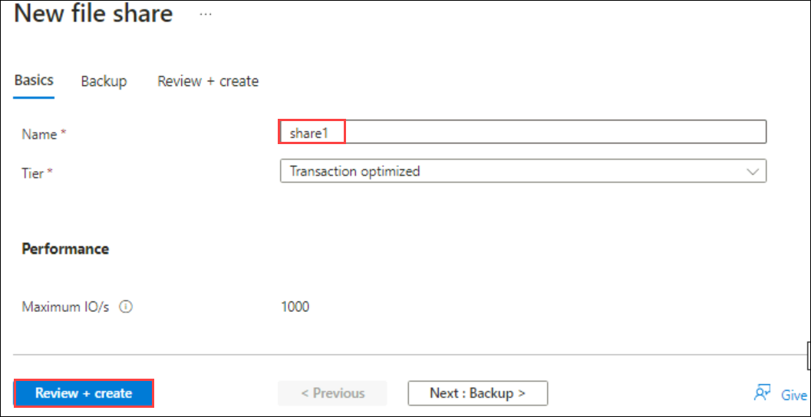

### Task 2: Use an Azure file share

1. On **SEA-ADM1**, in the Azure portal, in the details pane, select **share1**.

1. In the details pane, select **Upload**.

   

1. On the **Upload files** tab, browse to **C:\Labfiles\AZ-800-Administering-Windows-Server-Hybrid-Core-Infrastructure-master\Allfiles\Labfiles\Lab10\File1.txt**, select **Upload**, and when the upload is complete, close the **Upload files** tab.

1. On the **share1** page, select **Snapshots**, select **Add snapshot**, and then select **OK**.

    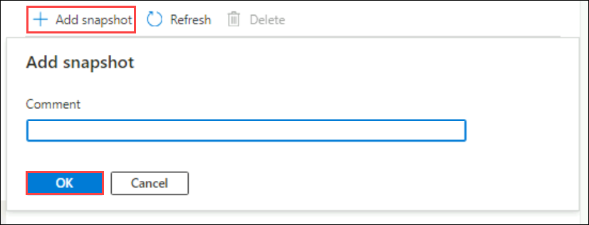

1. On the **share1** page, select **Overview**, select **Connect**.

   

1. select **Show Script**, use the **Copy to clipboard** button to copy the script, and then close the **Connect** tab.

   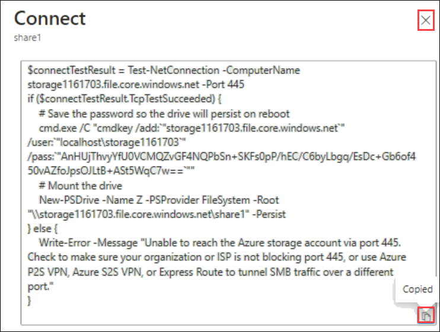

1. On **SEA-ADM1**, switch to the **Windows PowerShell ISE** window, open another tab in the script pane, and paste the copied script into it.

1. Review the content of the script, and then execute it by selecting the **Run Script** icon in the toolbar or by pressing F5. 

   >**Note:** The script mounted the Azure file share to drive letter **Z**.

   

1. On the taskbar, right-click or access the context menu for File Explorer, select **File Explorer**, and then, in the **Quick Access** text box, type Z:\ and then press Enter.

1. Verify that the file **File1.txt** appears in the details pane. This is the file that you uploaded to the Azure file share.

   

1. Double-click or select **File1.txt**, and then press Enter to open the file in Notepad. 

1. Use Notepad to modify the file content by appending your name in the last line, save the change, and close Notepad.

1. Right-click or access the context menu for **File1**, select **Properties**, and then, in the **File1 Properties** window, select the **Previous Versions** tab.

1. Verify that one previous file version is available. Select that version (**File1.txt**), select **Restore** twice, and then select **OK** twice.

   

1. Double-click or select **File1.txt**, select Enter, and then confirm that it doesn't include your name. This is because you restored the snapshot created before you modified the file.

1. Close **Notepad**.

### Task 3: Deploy Storage Sync Service and a File Sync group

1. On **SEA-ADM1**, in the Azure portal, in the **Search resources, services, and docs** text box in the toolbar, search for and select **Azure File Sync**.

1. On the **Basics** tab of the **Deploy File Sync** page, in the **Resource Group** drop-down list, select **AZ800-L1001-RG**. 

1. In the **Storage Sync Service name** text box, enter **FileSync1**. 

1. In the **Region** drop-down list, select the same region in which you created the storage account. 

1. On the **Basics** tab of the **Deploy File Sync** page, select **Review + Create** and **Create**.

     

1. On the **Deployment** blade, once the File Sync is provisioned, select **Go to resource**.

1. On the **FileSync1** **Storage Sync Service** page, select **Sync groups**, and then select **+ Sync group** to create a new File Sync group.

    

1. On the **Sync group** page, enter **Sync1 (1)** in the **Sync group name** text box.

1. Select **Select storage account**, and then, on the **Choose storage account (3)** page, select the storage account that you created. 

   >**Note:** If you can't find the storage account, it was probably deployed to a different Azure region. You need to ensure that the storage account resides in the same region as the Storage Sync Service.

1. In the **Azure File Share** drop-down list, select **share1 (4)**, and then select **Create (5)**.

   

1. In the Azure portal, in the **Search resources, services, and docs** text box in the toolbar, search for and select the **Storage Sync Service**. 

1. On the **Storage Sync Service** page, under **Sync** section, select **Registered servers**, and verify that there are no currently registered servers.

## Exercise 3: Replacing DFS Replication with File Sync-based replication

### Task 1: Add SEA-SVR1 as a server endpoint

1. On **SEA-ADM1**, in the Azure portal, on the **FileSync1 \| Registered servers** page, select the **Azure File Sync agent** link to go to the **Azure File Sync Agent** Microsoft Downloads page.  

    

1. On the **Azure File Sync Agent** Microsoft Downloads page, select **Download**.

    

1. Select the checkbox next to the entry for File Sync agent for Windows Server 2022 (**StorageSyncAgent_WS2022.msi**), and select **Next** to start the download. After the download is complete, close the Microsoft Edge tab that opened for the download.

    

1. Use File Explorer to copy the downloaded file to the **C:\Labfiles\AZ-800-Administering-Windows-Server-Hybrid-Core-Infrastructure-master\Allfiles\Labfiles\Lab10** folder.

1. In File Explorer displaying the content of the **C:\Labfiles\AZ-800-Administering-Windows-Server-Hybrid-Core-Infrastructure-master\Allfiles\Labfiles\Lab10** folder, in the details pane, select the file **Install-FileSyncServerCore.ps1**, display its context-sensitive menu, and right click, in the menu, select **Edit**.

   >**Note:** This will automatically open the file **Install-FileSyncServerCore.ps1** in the script pane of Windows PowerShell ISE.

1. In the **Windows PowerShell ISE** script pane, review the script, and then execute it by selecting the **Run Script** icon in the toolbar or by pressing F5. 

   >**Note:** Monitor the script execution. This should take about 3 minutes.

1. When prompted with a **WARNING** message to sign in, copy the nine-character code in the warning message to the Clipboard.

1. Switch to the Microsoft Edge window displaying the Azure portal, open a new tab by selecting **+**, and then, on the new tab, browse to **https://microsoft.com/devicelogin**.

1. In Microsoft Edge, in the **Enter code** dialog box, paste the code you copied into Clipboard, and then, if needed, sign in with your Azure credentials, on the page displaying the message.
   
   >**Note**: Are you trying to sign in to Microsoft Azure PowerShell?, select **Continue**, and then close the Microsoft Edge tab you opened in the previous step.
   
1. Switch to the **Windows PowerShell ISE** window and ensure that the script completed successfully. 

1. Switch back to the Microsoft Edge window displaying the Azure portal, and then, on the **FileSync1 \| Registered servers** page, select **Refresh** to display the current list of registered servers.

1. Verify that the **SEA-SVR1.Contoso.com** server appears on the list of registered servers of the **FileSync1** Storage Sync Service.

1. On **SEA-ADM1**, switch to the File Explorer window, in **Quick access** browse to the **\\\\SEA-SVR1\\Data** share, and verify that the folder doesn't currently contain **File1.txt**.

1. Switch to the Microsoft Edge window displaying the Azure portal, on the **FileSync1 \| Registered servers** page, under **Sync** section, select **Sync Groups**, select **Sync1**, and then, on the **Sync1** page, select **Add server endpoint**.

1. On the **Add server endpoint** tab, select **SEA-SVR1.Contoso.com (1)** in the **Registered servers** list.

1. In the **Path** text box, enter **S:\\Data (2)**, and then select **Create (3)**.

   


1. Switch to the File Explorer window and verify that the **\\\\SEA-SVR1\\Data** folder now contains **File1.txt**.

      

   >**Note:** if you not able to see **File1.txt**, kindly close and open **File Explorer** window, browse for **\\\\SEA-SVR1\\Data** folder in **Quick access**.
   >**Note:** You uploaded **File1.txt** to the Azure file share, from where it was synced to **SEA-SVR1** by File Sync.

### Task 2: Register SEA-SVR2 with File Sync

1. On **SEA-ADM1**, switch to the **Windows PowerShell ISE** window to the tab of the script pane displaying the content of the **Install-FileSyncServerCore.ps1** file.

1. In the **Windows PowerShell ISE** script pane, in the first line, replace `SEA-SVR1` with `SEA-SVR2`, save the change, and execute the script by selecting the **Run Script** icon in the toolbar or by pressing F5. 

   >**Note:** Monitor the script execution. This should take about 3 minutes.

1. When prompted with a **WARNING** message to sign in, copy the nine-character code in the warning message to the Clipboard.

1. Switch to the Microsoft Edge window displaying the Azure portal, open a new tab by selecting **+**, and then, on the new tab, browse to **https://microsoft.com/devicelogin**.

1. In Microsoft Edge, in the **Enter code** dialog box, paste the code you copied into Clipboard, and then, if needed, sign in with your Azure credentials, on the page displaying the message.
   
   >**Note**: Are you trying to sign in to Microsoft Azure PowerShell?, select **Continue**, and then close the Microsoft Edge tab you opened in the previous step.
   
1. Switch to the **Windows PowerShell ISE** window and ensure that the script completed successfully. 

1. When the script completes, switch to the Microsoft Edge window displaying the Azure portal and browse back to the **FileSync1 \| Registered servers** page.

1. Confirm that **SEA-SVR1.Contoso.com** and **SEA-SVR2.Contoso.com** are now both listed as registered servers with the **FileSync1** Storage Sync Service.

   

### Task 3: Remove DFS Replication and add SEA-SVR2 as a server endpoint

1. On **SEA-ADM1**, select **DFS Management** on the taskbar.

1. In **DFS Management**, in the navigation pane, right-click or access the context menu for **Branch1**, select **Delete**, select the **Yes, delete the replication group, stop replicating all associated replicated folders, and delete all members of the replication group** option, and then select **OK**.

1. Switch to the Microsoft Edge window displaying the Azure portal, browse back to the **FileSync1** **Storage Sync Service** page, in the list of sync groups, select **Sync1**, and then, on the **Sync1** page, select **Add server endpoint**.

1. In the Add server endpoint pane, select **SEA-SVR2.Contoso.com (1)** in the **Registered servers** list, enter **S:\\Data (2)** in the **Path** text box, and then select **Create (3)**.

    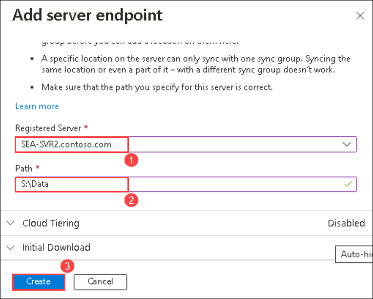

## Exercise 4: Verifying replication and enabling cloud tiering

### Task 1: Verify File Sync

1. On **SEA-ADM1**, switch to the File Explorer window displaying the content of the **\\\\SEA-SVR1\\Data** share. 

1. Create another arbitrarily named file in the **\\\\SEA-SVR1\\Data** folder.

1. On **SEA-ADM1**, switch to the File Explorer window displaying the content of the **\\\\SEA-SVR2\\Data** share and verify that, shortly afterwards, the file with the same name also appears in the **\\\\SEA-SVR2\\Data** folder.

   >**Note** You removed DFS Replication in the previous exercise, which means that File Sync replicated the newly created file.

### Task 2: Enable cloud tiering

1. On **SEA-ADM1**, in the Azure portal, on the **Sync1** sync group page, select **SEA-SVR2.Contoso.com** in the **server endpoints** section.

1. In the Server Endpoint Properties pane, Under **settings** section, select **Cloud Tiering Settings**. 

1. Select **Enable cloud Tiering** In the **Always preserve the specified percentage of free space on the volume** text box, enter **90** and select **Enabled Date policy**. In the **Only cache files that were accessed or modified within the specified number of days** text box, enter **14**, and then select **Save**.  

   >**Note:** After some time, files on **SEA-SVR2** would be automatically tiered. You will trigger this process by using PowerShell.

1. On **SEA-ADM1**, switch to the **Windows PowerShell ISE** window:

1. In the **Windows PowerShell ISE**, in the console pane, trigger tiering immediately by entering the following commands and pressing Enter after each:

   ```powershell
   Enter-PSSession -computername SEA-SVR2
   fsutil file createnew S:\Data\report1.docx 254321098
   fsutil file createnew S:\Data\report2.docx 254321098
   fsutil file createnew S:\Data\report3.docx 254321098
   fsutil file createnew S:\Data\report4.docx 254321098
   Import-Module "C:\Program Files\Azure\StorageSyncAgent\StorageSync.Management.ServerCmdlets.dll"
   Invoke-StorageSyncCloudTiering -Path S:\Data 
   ```
1. On **SEA-ADM1**, switch to the File Explorer window displaying the content of the **\\\\SEA-SVR2\\Data** folder.

      

1. In the File Explorer window, add the **Attributes** column in the details pane by right-clicking or accessing the context menu for the **Title** column in the details pane; for example, in the **Name** column, select **More**, select the **Attributes** checkbox, and then select **OK**.

1. Drag the **Attributes** column to be next to the **Name** column, and then note the file dates and their attributes.

1. Identify files with the attribute **L**, **M**, and **O**, which indicate that the tiering took place. 

## Exercise 5: Troubleshooting replication issues

### Task 1: Monitor File Sync replication

1. On **SEA-ADM1**, use File Explorer to copy the **C:\\Windows\\INF** folder to **\\\\SEA-SVR2\\Data\\**. The folder will sync to the cloud endpoint, which will cause sync traffic.

1. On **SEA-ADM1**, switch to the Azure portal displaying the **Sync1** sync group page of the **FileSync1** Storage Sync Service.

1. In the **server endpoints** section, verify that the **Health** of both endpoints has green check marks.

1. Select the **SEA-SVR2.Contoso.com** endpoint in the Server Endpoint Properties pane, review **Sync Activity**, and then close the pane.

1. Select the **Files Synced** graph, and then explore how you can customize the graph by using a filter.

1. Switch to the File Explorer window displaying the content of drive **Z** mapped to the Azure File share and verify that the drive contains the content of the **INF** folder synchronized from **\\\\SEA-SVR2\\Data**.

1. Switch to the Azure portal displaying **Sync1** under **Monitoring** section, select status and verify that the **INF** sync traffic is reflected in the **Files Synced** and **Bytes Synced** graphs. The **INF** folder has more than 800 files, and its size is more than 40 MB.

    

   >**Note:** You might need to refresh the page displaying the Azure portal to see the updated statistics.

### Task 2: Test replication conflict resolution

1. On **SEA-ADM1**, position the File Explorer windows displaying the content of **\\\\SEA-SVR1\Data\\** and **\\\\SEA-SVR2\Data\\** side-by-side.

1. In the File Explorer window displaying the content of **\\\\SEA-SVR1\Data\\**, create a file named **Demo.txt**. 

1. In the File Explorer window displaying the content of **\\\\SEA-SVR2\Data\\**, create a file named **Demo.txt**. 

1. Add an arbitrary text to the first **Demo.txt** file and save the change.

1. Immediately afterwards, add an arbitrary text (different from the one you used in the previous step) to the second **Demo.txt** file and save the change.

   >**Note:** Make sure to save the change to the second file as soon as possible. You're creating files with the same name but different content to intentionally trigger a sync conflict.

1. In each File Explorer window, review their content and verify what they contain, in addition to the **Demo.txt** file, also check for **Demo-SEA-SVR2.txt** (and potentially **Demo-Cloud.txt**). 

   >**Note:** This is because File Sync detected a sync conflict and added a suffix representing the endpoint name (**SEA-SVR2**) or **Cloud** to the file that caused the conflict.

   >**Note:** You might need to wait a few minutes for the sync conflict to occur.

  > **Congratulations** on completing the task! Now, it's time to validate it. Here are the steps:
   > - Click Lab Validation tab located at the upper right corner of the lab guide section and navigate to the Lab Validation tab.
   > - Hit the Validate button for the corresponding task.
   > - If you receive a success message, you can proceed to the next task. If not, carefully read the error message and retry the step, following the instructions in the lab guide.
   > - If you need any assistance, please contact us at labs-support@spektrasystems.com. We are available 24/7 to help you out.

### Review
In this lab, you have completed:
- Deploy and test DFS deployment
- Create and use an Azure file share
- Deploy Storage Sync Service and a File Sync group
- Add SEA-SVR1 as a server endpoint and register SEA-SVR2 with File Sync
- Remove DFS Replication and add SEA-SVR2 as a server endpoint
- Verify File Sync and enable cloud tiering
- Monitor File Sync replication and test replication conflict resolution

### You have successfully completed the lab
